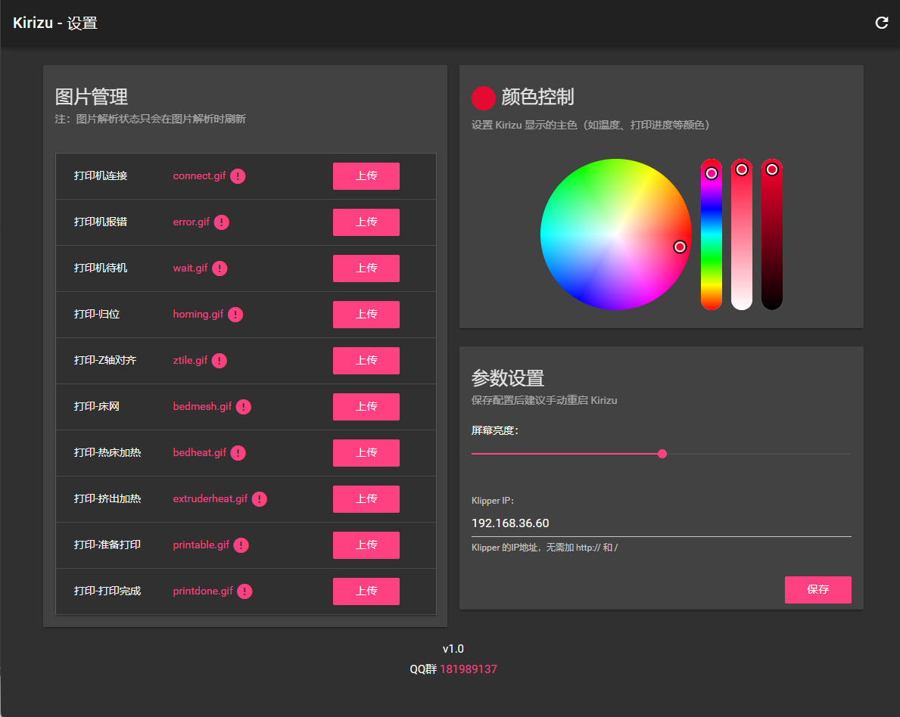

# Kirizu-Screen Firmware
基于 Klipper - Moonraker 的3D打印机状态显示小屏幕，支持自定义图片和Web端管理。


## 硬件
请移步：[立创开源硬件平台](https://oshwhub.com/onnsenn/voron-kirizu)
## 使用
### 固件编译
> 您通常不需要自己编译固件，请前往 [Releases](https://github.com/Kirizu-Official/Kirizu-Screen/releases) 下载已编译好的固件，请根据自己所购买的Esp32-C3的Flash大小进行选择（通常是4MB）

* firmware_1.x.x_4MB.bin
* firmware_1.x.x_2MB.bin

> 如果您需要编译固件，本工程基于Platformio进行开发，克隆本仓库后使用VsCode安装Platformio插件编译即可。（请注意在platformio.ini中切换partitions分区表切换flash大小）

### 固件刷写

请参考 `docs` 目录中的 [固件刷写教程.pdf](https://github.com/Kirizu-Official/Kirizu-Screen/blob/a941b020c33951e4da1f5b79b8bafaa7238f4086/docs/%E5%9B%BA%E4%BB%B6%E5%88%B7%E5%86%99%E6%95%99%E7%A8%8B.pdf)

### 网络配置

当你首次使用时，将会自动进入配网模式，后续如需重新配网请按照 `插电` - `屏幕显示` - `2秒内断电` 的操作重复8次，系统将会再次进入配网模式，详细教程请参考 `docs` 目录中的 [配网教程.pdf](https://github.com/Kirizu-Official/Kirizu-Screen/blob/a941b020c33951e4da1f5b79b8bafaa7238f4086/docs/%E9%85%8D%E7%BD%91%E6%95%99%E7%A8%8B.pdf)

### Gcode 配置

详细请参考 `docs` 目录中的 [Gcode代码设置.pdf](https://github.com/Kirizu-Official/Kirizu-Screen/blob/a941b020c33951e4da1f5b79b8bafaa7238f4086/docs/Gcode%E4%BB%A3%E7%A0%81%E8%AE%BE%E7%BD%AE.pdf)

在控制台新建一个文件，命名为 `kirizu.cfg`，并且在 `printer.cfg` 中任意找个位置引入 `[include kirizu.cfg]`，并修改 `printer.cfg`：

#### 归为代码

```
[gcode_macro G28]
rename_existing: G2800
variable_homing:False
gcode:
    SET_GCODE_VARIABLE MACRO=G28 VARIABLE=homing VALUE=True
    G2800 {rawparams}
    SET_GCODE_VARIABLE MACRO=G28 VARIABLE=homing VALUE=False
```
#### Z轴对齐代码
这个通常是3Z或者2Z机器使用，龙门架调平暂不支持，欢迎提交PR
```
[gcode_macro Z_TILT_ADJUST]
rename_existing: Z_TILT_ADJUST_BASE
variable_probing:False
gcode:
    SET_GCODE_VARIABLE MACRO=Z_TILT_ADJUST VARIABLE=probing VALUE=True
    Z_TILT_ADJUST_BASE
    SET_GCODE_VARIABLE MACRO=Z_TILT_ADJUST VARIABLE=probing VALUE=False
```
#### 床网补偿代码
```
[gcode_macro BED_MESH_CALIBRATE]
rename_existing: BED_MESH_CALIBRATE_BASE
variable_probing:False
gcode:
    SET_GCODE_VARIABLE MACRO=BED_MESH_CALIBRATE VARIABLE=probing VALUE=True
    BED_MESH_CALIBRATE_BASE
    SET_GCODE_VARIABLE MACRO=BED_MESH_CALIBRATE VARIABLE=probing VALUE=False
```
### Klicky冲突解决
如果使用了Klicky可能会导致相关Gcode出现问题，请将以下内容复制到Gcode文件中
```
[gcode_macro _HOME_Y]
gcode:
    G2800 Y0
[gcode_macro _HOME_X]
gcode:
    G2800 X0
```
并且打开 `klicky-macros.cfg` 文件，搜索 `G28 Z0` 替换未 `G2800 z0`

### 图片自定义
固件从SD卡中读取文件进行显示，仅支持Gif格式的图片，加热中（含热端、热床）图片分辨率为 100(h) * 240(w)，其余图片均为240*240.

## 关于

* 本项目**从未抄袭**或参考必趣(bigtreetech)代码，也请 bigtreetech 不要使用本项目代码（毕竟您大佬应该看不上吧（笑
* 本项目默认图片提取自 bigtreetech 的 KNOMI。

## QQ群

点击链接加入群聊【Kirizu-Screen 交流群】：https://qm.qq.com/q/g79NL2pWdU

## 赞助

该项目开发花费了我大量的时间，如果您觉得对你有帮助欢迎请我喝杯奶茶

### 支付宝


### 微信


